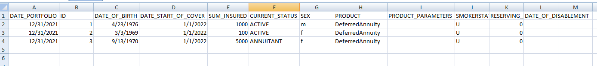

Portfolios
--------------

The key input need to run ``pyprotolinc`` is the portfolio data, i.e. a table containing seriatim record information.
The most convenient way is to import a portfolio from an Excel file using a ``pyprotolinc.portfolio.PortfolioLoader`` object::

    import pyprotolinc.portfolio as ptf

    portfolio_path = "../portfolio_small3.xlsx"
    ptf_loader = ptf.PortfolioLoader(portfolio_path)

Portfolio files have to look like this (where the order of the columns does not matter):

The columns have the obvious meanings:

* DATE_PORTFOLIO the date at which the snapshot is valid, must be equal for all records.
* ID a unique indentifier
* DATE_OF_BIRTH
* DATE_START_OF_COVER
* SUM_INSURED sum insured (or yearly annuity amount)
* CURRENT_STATUS corresponds with the state in the state model the record is in at DATE_PORTFOLIO
* SEX gender (m/f)
* PRODUCT is a string that references a product
* PRODUCT_PARAMETERS additional product parameters
* SMOKERSTATUS
* RESERVING_RATE the interest rate that should be used for the reserve calculations
* DATE_OF_DISABLEMENT
    
When importing using the `loader` certain validations will be performed on the fly and to be able to validate the the status
a corresponding state model class must be passed in to load the portfolio::

    portfolio = ptf_loader.load(selected_state_model)

Moreover, to save some time a cacheing of the portfolios is implemented when instatiating with a second path argument which has to be a folder::
 
    ptf.PortfolioLoader(portfolio_path, cache_path)

In this case pickled versions of the portfolios read will be stored under the path and laoding portfolios will be attempted under this path first.