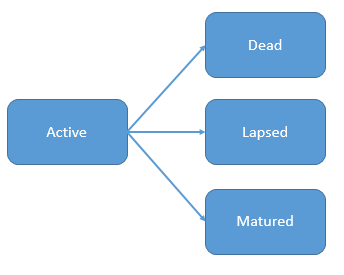
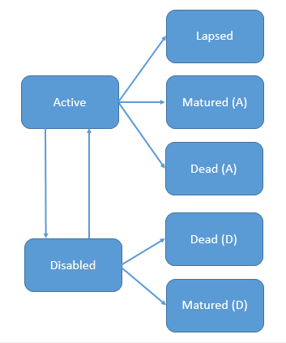

State Models
-------------

When invoking the projection engine of ``PyProtolinc`` the *state model* to be used is a key
parameter which is fixed throughout a run. This implies that portfolios of insurance policies
which would required distinct state models must be broken up accordingly and run separately from one another.

Concept
^^^^^^^^^^^^

In principle a *state model* is given by a (finite) number of *ordered states*, which represent different status a policyholder
can be in at a given point in time, as well as the possible transitions between them. We can imagine this as a graph
as follows:

.. image:: state_annuity.png

There are two states and the (one-sided) arrow indicates that a transition from state *Annuitant* to state *Dead* is
possible. This could represent a state model that can be used for a portfolio of annuities in the payment phase. In this
scenario the insurer would make annual or monthly payments to the insured person as long as the person is alive.

Let's have a look at another example which could be used for a *mortality term insurance*. In this case the policy
has a certain duration (e.g. 10 years) and the insurer 

At the beginning of the lifetime of the policy the insured is in the state *Active* (and would pay annual or monthly
insurance premiums). The arrows
represent the following state changes:

  * to *Dead* if the insured dies before the end of the term, in this case the insurer would pay the insured amount. 
  * to *Lapsed* if the policy holder surrenders. This means no death benefit will be paid and no premiums are due anymore but there
    might be surrenders benefits.
  * to *Matured* if the term ends before the insured has died.

It is *important to note* that the statements about payments made from either side are only given for illustration, they
are not linked to the state model but rather a part of the *product definition* discussed later (which is, of course,
linked to a state model again)

The final example discussed here is the the following

There are seven states and various transitions between them. The insurance product one should think of 
is an income protection product with a given term (or end age) which pays an annuity as long as the insured is *disabled*
(the exact meaning of this
needs to be defined in the policy terms) and has not reached the end of the term. While *actives* can become disabled
it is also possible that *disbaled* become *actives* again, something often referred to as *recovery*. In the graph
above there are therefore two arrows
between the states *Active* and *Disabled* indicating the possible transitions in both ways. Note furthermore, that 
there are two *Dead* states. In most cases it is probably a modelling decision if these states should be separated or not,
the same applies to the *Matured* states.

**Remark**: Sometimes modelling purposes may imply the need to break a logical *states* (motivated by the product) 
up into more granular model states. An example could be that the modeller want to use different *recovery probabilities*
depending on how long the policy holder is in the disabled state and for this purpose the disabled state could be broken
up into the states as follows:

  * *Disabled (1st year)*
  * *Disabled (2nd to 5th year)*
  * *Disabled (6th year and later)*

These additional states would then be complemented by a number of additional transitions.

Implementation
^^^^^^^^^^^^^^^^^^^^^^^^

In ``PyProtolinc`` the states in a states model are essentially represented by a Python ``IntEnum``.
As an example recall the first example above and then let's have a look at the following class from the module ``pyprotolinc.models.model_annuity_runoff`` 
which looks as follows::
    
    @unique
    class AnnuityRunoffStates(IntEnum):
        """ A state model consisting of two states:
            - DIS1 (=0) representing the annuity phase
            - DEATH (=1)
        """
        DIS1 = 0    # the "annuitant state"
        DEATH = 1   # the death state

        @classmethod
        def to_std_outputs(cls):
            return {
                ProbabilityVolumeResults.VOL_DIS1: cls.DIS1,
                ProbabilityVolumeResults.VOL_DEATH: cls.DEATH,
                ProbabilityVolumeResults.MV_DIS1_DEATH: (cls.DIS1, cls.DEATH),
            }

Note that there are two member ``DIS1`` and ``DEATH`` representing the two states (albeit with different names). Besides that there is a classmethod
which provides a mapping of the standard output model to this model (but this discussion will need to take place elsewhere).
While the ``IntEnum`` above declares the states the transitions between them will be modelled by a corresponding
*matrix of transition providers*, a topic which will be discussed further in the Section about assumptions. 